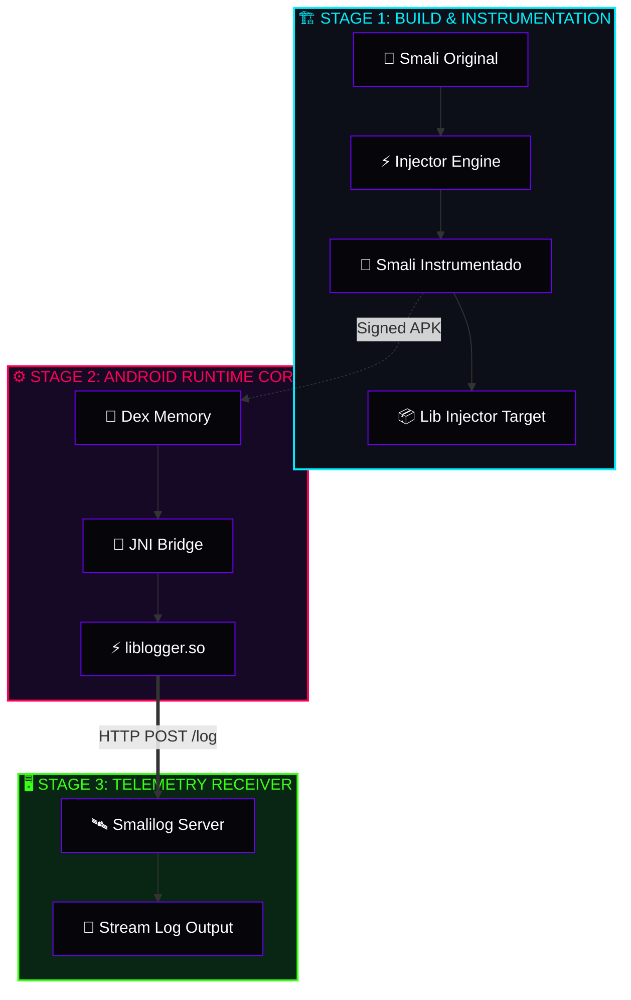
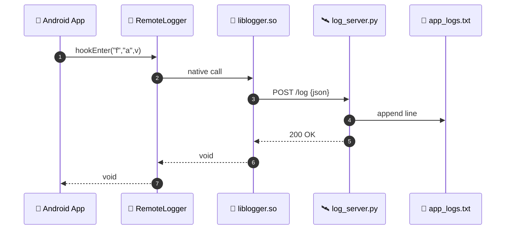

<div align="center">

```
██████╗ ███╗   ███╗██████╗ ██╗     ██╗██╗      ██████╗  ██████╗
██╔════╝ ████╗ ████║██╔══██╗██║     ██║██║     ██╔═══██╗██╔════╝
╚█████╗  ██╔████╔██║██████╔╝██║     ██║██║     ██║   ██║██║  ███╗
╚═══██╗ ██║╚██╔╝██║██╔═══╝ ██║     ██║██║     ██║   ██║██║   ██║
██████╔╝ ██║ ╚═╝ ██║██║     ███████╗██║███████╗╚██████╔╝╚██████╔╝
╚═════╝  ╚═╝     ╚═╝╚═╝     ╚══════╝╚═╝╚══════╝ ╚═════╝  ╚═════╝
```

### ⚡ [ SYSTEM STATUS: EXPERIMENTAL LOGGING FRAMEWORK ] ⚡

> Inyector automático de trazabilidad y servidor de logs dinámicos para análisis y modificación de bytecode Smali en aplicaciones Android.


---


</div>

---

<a id="index"></a>
## [00] INDEX // TABLA DE CONTENIDOS

- [◈ 01. Visión general](#overview)
- [◈ 02. Arquitectura de datos](#architecture)
- [◈ 03. Estructura del proyecto](#filesystem)
- [◈ 04. Especificaciones de API](#api)
- [◈ 05. Motor JNI & Reglas Smali](#jni)
- [◈ 06. Servidor de logs](#server)
- [◈ 07. Inyector Smali](#injector)
- [◈ 08. Compilación nativa](#compile)
- [◈ 09. Integración en APK](#deploy)
- [◈ 10. Instalación](#-instalación)
- [◈ 11. Pruebas](#testing)
- [◈ 12. Roadmap & Estado](#roadmap)
- [◈ 13. Consideraciones de seguridad](#security)
- [◈ 14. Contribuir](#contributing)

---

<a id="overview"></a>
## [01] VISIÓN GENERAL

`SMALILOG` es un sistema **experimental de telemetría y logging remoto** diseñado para Android Runtime (ART). Permite instrumentar binarios descompilados (`Smali`) para extraer trazas críticas en tiempo real —puntos de entrada/salida, argumentos, tipos y mensajes de runtime— transmitiéndolos vía **C/JNI** hacia un servidor HTTP local.

Orientado a auditorías de seguridad, *reverse engineering*, depuración dinámica y análisis en entornos **Termux + ARM64**.

> **Target ABI:** ARM64 / AArch64  
> **Runtime:** Android OS + Termux

---

<a id="architecture"></a>
## [02] ARQUITECTURA DE DATOS



### Secuencia runtime



---

<a id="filesystem"></a>
## [03] ESTRUCTURA DEL PROYECTO

```text
smalilog/
├── bin/                 # Librerías nativas compiladas (.so)
├── build_payloads/      # Fuentes Java/Android y clases para inyección
├── box/                 # Muestras Smali y pruebas de concepto
├── src/smalilog/        # Paquete principal en Python
│   ├── injector/        # Motor de parseo, análisis de registros e inyección
│   ├── server/          # Servidor receptor de logs
│   └── android/         # Utilidades de comunicación cliente-servidor
└── tests/               # Suite de pruebas unitarias
```

---

<a id="api"></a>
## [04] ESPECIFICACIONES DE API

### API Java

```java
RemoteLogger.d(tag, message);
RemoteLogger.hookEnter(function, argumentName, value);
RemoteLogger.hookExit(function, result);
```

### Tipos soportados

| Categoría | Tipos |
|---|---|
| Primitivos / Null | `null`, `String`, `Boolean` |
| Numéricos | `Integer`, `Long`, `Double`, `Float`, `int[]` |
| Complejos | `Object`, `Bundle` |

---

<a id="jni"></a>
## [05] MOTOR JNI & REGLAS SMALI


Payload JSON esperado por el servidor:

```json
{
    "level": "INFO",
    "tag": "MainActivity",
    "message": "onCreate iniciado"
}
```

> [!NOTE]
> **Política de buffer:** `MAX_HEADERS = 16 KiB`, `MAX_BODY = 1 MiB`.

> [!IMPORTANT]
> Los registros usados en los hooks deben alinearse estrictamente con los tipos y firmas reales de la función original.

**Fórmula de cálculo de registros:**

```text
REGISTROS_TOTALES = REGISTROS_ORIGINALES + REGISTROS_EXTRA_HOOKS

Ejemplo:  .registers 2  →  .registers 6   (4 slots extra)
```

- **Rango seguro de temporales:** si `.registers` sube de `N_old` a `N_new`, el espacio libre es `v[N_old] .. v[N_new - 1]`.
- **Mapeo `p`:**
  - Instancia → `p0` = `this`, argumentos desde `p1`.
  - Estático → argumentos desde `p0`.
- **Alias `p0, p1, …`** se re-mapean automáticamente tras recalcular `.registers`.
- **Control de destrucción:** verificar que no se sobrescriban registros vivos.

---

<a id="server"></a>
## [06] SERVIDOR DE LOGS

```python
HOST = "127.0.0.1"
PORT = 9999
```

> [!WARNING]
> La librería `.so` está compilada de forma rígida (hardcoded) para hablar con este socket loopback.

**Despliegue:**

```bash
smalilog serve
```

Salida esperada:

```text
[+] SERVER_LISTEN: http://127.0.0.1:9999 [READY]
```

**Prueba con `curl`:**

```bash
curl -X POST http://127.0.0.1:9999/log \
     -H 'Content-Type: application/json' \
     -d '{"level":"INFO","tag":"APP","message":"hola"}'
```

---

<a id="injector"></a>
## [07] INYECTOR SMALI (`injector/`)

```bash
smalilog hook list       app.smali
smalilog hook show       app.smali -m Sf
smalilog hook analyze    app.smali -m Sf --sig "(I)V"
smalilog hook enter      app.smali -m Sf
smalilog hook exit       app.smali -m Sf
smalilog hook log        app.smali -m Sf --tag APP --message "hola"
smalilog hook lifecycle  Application.smali -m onCreate
```

**API programática:**

```python
from smalilog.injector.hooker import run_hooker

run_hooker(["app.smali", "-m", "Sf", "enter"])
```

**Capacidades:**

- ⚡ Detección automática de sobrecargas (`--signature`).
- ⚡ Planificación dinámica de registros vía `plan_hook_registers()`.
- ⚡ Preservación estricta de tipos *wide* (`J`, `D`) al mapear `p → v`.
- ⚡ Manejo adaptativo *static* vs *instance* (`p0` context awareness).
- ⚡ Marcadores idempotentes anti-doble inyección.
- ⚡ Resaltado de sintaxis opcional vía **Pygments** (fallback propio).

---

<a id="compile"></a>
## [08] COMPILACIÓN NATIVA (AArch64)

```bash
aarch64-linux-android-clang \
    -shared \
    -fPIC \
    -O2 \
    -fno-exceptions \
    -fno-rtti \
    -o liblogger.so \
    native_logger.c \
    -I/usr/lib/jvm/java-8-openjdk-amd64/include \
    -I/usr/lib/jvm/java-8-openjdk-amd64/include/linux
```

**Auditoría de dependencias:**

```bash
readelf -d liblogger.so | grep NEEDED
```

Salida esperada:

```text
0x0000000000000001 (NEEDED) Shared library: [libdl.so]
0x0000000000000001 (NEEDED) Shared library: [libc.so]
```

> [!CAUTION]
> Dependencias adicionales indican enlaces no deseados que podrían romper la portabilidad del APK.

---

<a id="deploy"></a>
## [09] INTEGRACIÓN EN UNA APK


Estructura ABI objetivo:

```text
lib/
└── arm64-v8a/
    └── liblogger.so
```

---
## [09] Intalacion

```bash 
git clone [https://github.com/usuario/smalilog.git](https://github.com/usuario/smalilog.git)
cd smalilog

# Creación de entorno e instalación editable
python -m venv .venv
source .venv/bin/activate
pip install -e ".[dev]"


```

---

<a id="testing"></a>
## [10] PRUEBAS

`MainActivity` valida:

- 🟢 Inicialización de `RemoteLogger`
- 🟢 Trazas simples (`d`)
- 🟢 `hookEnter` / `hookExit`
- 🟢 Extracción multi-tipo Java
- 🟢 Ciclo de vida (`onCreate`, `onResume`, `onPause`)
- 🟢 Comunicación end-to-end con el servidor

---

<a id="roadmap"></a>
## [11] ROADMAP & ESTADO

```text
STATUS METRIC: [████████░░] 80% — Experimental / WIP
```

### ✅ Implementado

- [x] API Java (`d`, `hookEnter`, `hookExit`)
- [x] Logging por niveles (`DEBUG`, `INFO`, `WARNING`, `ERROR`)
- [x] Puente JNI (`native_logger.c`)
- [x] Binario `liblogger.so` (ARM64)
- [x] Receiver Server en Python
- [x] Parsing y validación HTTP
- [x] Engine de inyección Smali
- [x] Soporte multi-tipo

### 🚧 En desarrollo

- [ ] Dashboard web de monitoreo
- [ ] Refactor a WebSockets / TLS
- [ ] Instrumentación Smali *zero-touch*
- [ ] Motor de filtros por TAG / regex / severidad
- [ ] Timestamps sincronizados desde cliente
- [ ] Tests unitarios e integración
- [ ] Smali API Complete Reference Guide

---

<a id="security"></a>
## [12] CONSIDERACIONES DE SEGURIDAD

> [!WARNING]
> **Declaración de uso ético y legal**
>
> Este framework ha sido diseñado únicamente para investigación, auditorías de seguridad, depuración dinámica y análisis de software **bajo autorización expresa**.
>
> Queda estrictamente prohibido su uso para exfiltración no autorizada, análisis malicioso o interceptación en dispositivos sin consentimiento.
>
> **Ámbito de red:** el servidor escucha por defecto en `127.0.0.1` (loopback) y **no** está preparado para producción.

---

<a id="contributing"></a>
## [13] CONTRIBUIR

Las Pull Requests son bienvenidas. Revisa el [roadmap](#roadmap) antes de enviar propuestas.

---

<div align="center">

**Coded with ☕ and low-level `readelf` analysis**  
`REMOTE LOGGER FRAMEWORK // EXPERIMENTAL EDITION`

</div>
