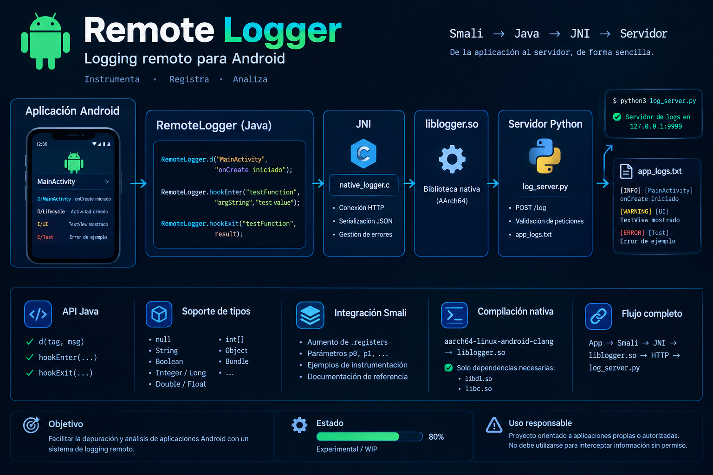
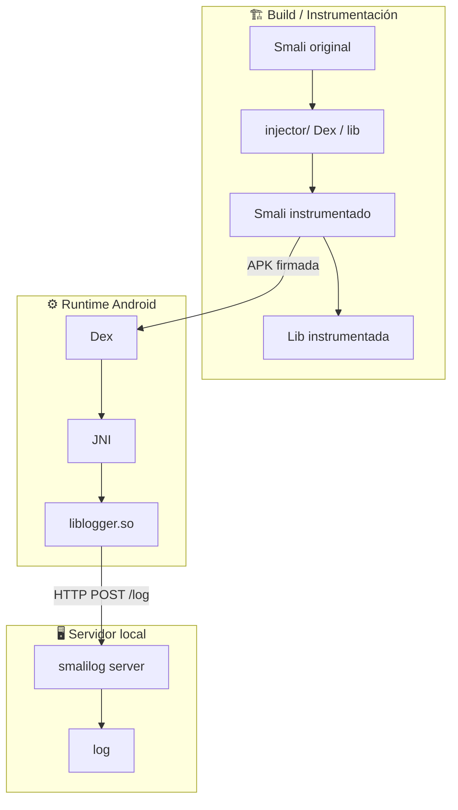
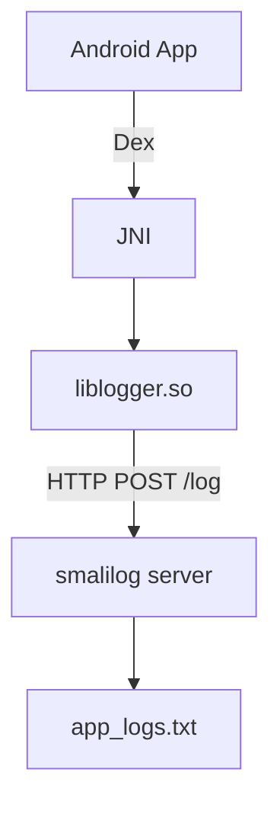
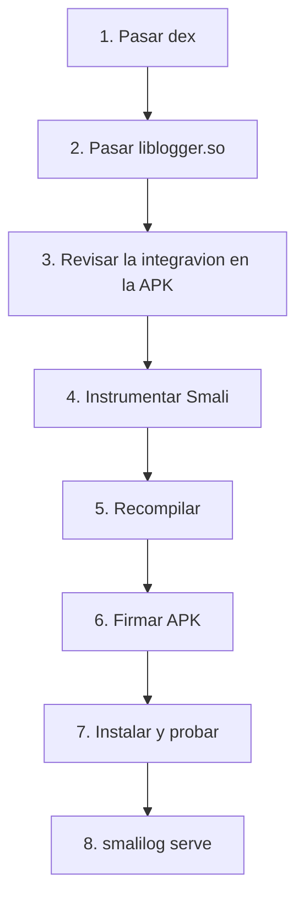

README.md — Remote Logger


 


Sistema experimental de logging remoto para Android basado en JNI + Smali

<div align="center">


</div>


[linea](https://github.com/VictorH028/VictorH028/blob/main/.img/linea.gif) 

📖 Tabla de contenidos

· Descripción
· Arquitectura
· Estructura del proyecto
· API
  · Tipos soportados
  · Smali
· Servidor de logs
· Inyector Smali (injector/)
· Compilación nativa
· Integración en una APK
· Estado del proyecto
· Contribuir
· Documentación relacionada

[linea](https://github.com/VictorH028/VictorH028/blob/main/.img/linea.gif) 

📌 Descripción

Smalilog es un sistema experimental de log remoto para Android. Permite instrumentar aplicaciones (Smali) para enviar trazas de ejecución -entradas de funciones, argumentos, valores de retorno y mensajes arbitrarios— hacia un servidor local mediante una biblioteca nativa JNI que se comunica por HTTP.

El proyecto está diseñado para ser usado en investigación, depuración y análisis de aplicaciones propias o autorizadas, con un enfoque práctico sobre Termux + ARM64.

⚠️ Estado: Experimental / WIP · Plataforma principal: Android + Termux · ABI objetivo: ARM64 / AArch64

[linea](https://github.com/VictorH028/VictorH028/blob/main/.img/linea.gif) 

🧭 Arquitectura


[linea](https://github.com/VictorH028/VictorH028/blob/main/.img/linea.gif) 

📁 Estructura del proyecto

- [inyector](url) 
- [server](url)
- [cli]()

[linea](https://github.com/VictorH028/VictorH028/blob/main/.img/linea.gif) 

🧩 Tipos soportados en las pruebas

```text
null      String     Boolean    Integer
Long      Double     Float      int[]
Object    Bundle
```

[linea](https://github.com/VictorH028/VictorH028/blob/main/.yyimg/linea.gif) 

🧬 Flujo JNI



El servidor espera un JSON como:

```json
{
    "level": "INFO",
    "tag": "MainActivity",
    "message": "onCreate iniciado"
}
```

Y aplica límites tanto a cabeceras (MAX_HEADERS = 16 KiB) como al cuerpo (MAX_BODY = 1 MiB).

---

🧱 Integración mediante Smali

Una vez disponible el dex y la libreria en la aplicación objetivo. 


```smali
smalilog hook --help
```

Nota: los registros utilizados deben coincidir con los tipos y valores reales de la función original.

> [!NOTE]
> Informar de culaquier error 


📐 Reglas de registros Smali

· Rango seguro de temporales: si .registers sube de N_old a N_new, los temporales frescos son v[N_old] .. v[N_new - 1].
· Parámetros p:
  · En métodos de instancia: p0 es this; los argumentos reales comienzan en p1.
  · En métodos estáticos: los argumentos reales comienzan en p0.
· Alias p0, p1, … siguen funcionando tras aumentar .registers; el ensamblador recalcula sus posiciones.
· No basta con aumentar .registers: hay que verificar que las nuevas instrucciones no sobrescriban registros aún vivos.

Regla práctica:

```text
registros nuevos = registros originales + registros usados por los hooks
```

Ejemplo: .registers 2 puede convertirse en .registers 6 si se necesitan 4 registros adicionales.


[linea](https://github.com/VictorH028/VictorH028/blob/main/.yyimg/linea.gif) 

🖥️ Servidor

Servidor HTTP minimalista en Python.

Configuración por defecto

```python
HOST = "127.0.0.1"
PORT = 9999
```

> [!WARNING]
> La libreria .os que se inyecta solo admite la configuración vista 

Ejecución

Desde Termux:

```bash
smalilog serve 
```

Salida esperada:

```text
Servidor de logs en http://127.0.0.1:9999
```

Ejemplo de petición

```bash
curl -X POST http://127.0.0.1:9999/log \
     -H 'Content-Type: application/json' \
     -d '{"level":"INFO","tag":"APP","message":"hola"}'
```

---

🧪 Inyector Smali (injector/)

El comando implementa un inyector automático de hooks sobre archivos Smali.

Uso por CLI

```bash
smalilog hook list       app.smali
smalilog hook show       app.smali -m Sf
smalilog hook analyze    app.smali -m Sf --sig "(I)V"
smalilog hook enter      app.smali -m Sf
smalilog hook exit       app.smali -m Sf
smalilog hook log        app.smali -m Sf --tag APP --message "hola"
smalilog hook lifecycle  Application.smali -m onCreate
```

Uso programático

```python
from smalilog.injector.hooker import run_hooker

run_hooker(["app.smali", "-m", "Sf", "enter"])
```

Comportamiento

· Detecta sobrecargas y permite desambiguar con --signature.
· Planifica registros frescos con plan_hook_registers().
· Preserva los tipos wide (J, D) al mapear p → v.
· Respeta métodos static vs instance al resolver p0.
· Evita dobles inyecciones mediante marcadores (Hook ENTER inyectado, etc.).
· Resaltado opcional con Pygments (fallback propio si no está instalado).

📘 Mas información [link](url) .

---

🔨 Compilación de la biblioteca nativa

Para AArch64:

```bash
aarch64-linux-android-clang \
    -shared \
    -fPIC \
    -O2 \
    -fno-exceptions \
    -fno-rtti \
    -o liblogger.so \
    native_logger.c \
    -I/usr/lib/jvm/java-8-openjdk-amd64/include \
    -I/usr/lib/jvm/java-8-openjdk-amd64/include/linux
```

Resultado esperado:

```text
liblogger.so
```

Comprobación de dependencias

```bash
readelf -d liblogger.so | grep NEEDED
```

Salida esperada:

```text
0x0000000000000001 (NEEDED) Shared library: [libdl.so]
0x0000000000000001 (NEEDED) Shared library: [libc.so]
```

Si aparecen dependencias adicionales, la compilación introdujo enlaces no deseados.

---

📦 Integración en una APK



La biblioteca nativa debe ubicarse en la ruta ABI correspondiente:

```text
lib/arm64-v8a/liblogger.so
```

---

🧪 Pruebas

MainActivity funciona como aplicación de pruebas para verificar:

· Inicialización de RemoteLogger
· Logs simples (d)
· hookEnter / hookExit
· Diferentes tipos Java
· Ciclo de vida de una Activity
· Comunicación extremo a extremo con el servidor

Actualmente se emiten eventos durante:

```text
onCreate
onResume
onPause
```

---

📌 Estado del proyecto

```text
[████████░░] 80% — Experimental / WIP
```

✅ Implementado

· API Java (d, hookEnter, hookExit)
· Logging por niveles
· Puente JNI (native_logger.c)
· Biblioteca liblogger.so
· Servidor Python (LogServer)
· Recepción HTTP con validación básica
· Inyector Smali (injector/)
· Pruebas con múltiples tipos Java

🚧 En desarrollo

· Visualización web de logs
· Mejoras de protocolo y manejo de errores
· Instrumentación Smali completamente automatizada
· Sistema de filtros por tag y nivel
· Timestamps del lado del cliente
· Tests automatizados
· Documentación completa de la API Smali

---

⚠️ Consideraciones

Este proyecto está orientado a instrumentación, depuración y análisis de aplicaciones Android propias o autorizadas.

No debe utilizarse para interceptar información de aplicaciones, dispositivos o usuarios sin autorización explícita.

Además, el servidor escucha únicamente en 127.0.0.1 y no está diseñado como servidor de producción.

---

🤝 Contribuir

Las contribuciones son bienvenidas. 

📚 Documentación relacionada

· Documentación de Smali
· Documentación JNI (Oracle / Android NDK)
· Android Runtime (ART)
· Android Application Lifecycle
· ELF / readelf
· AArch64 ABI

---

<div align="center">

Hecho con ☕ y mucho readelf · Remote Logger · Experimental / WIP

</div>
