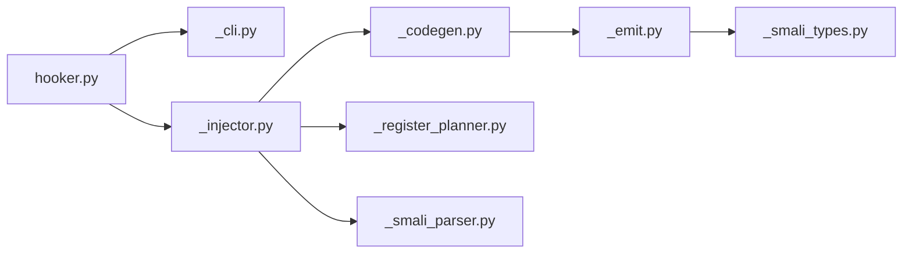

# Estructuta 

```
injector/
├── __init__.py
├── hooker.py                 # Fachada pública + run_hooker (CLI entry)
├── _colors.py                # Color, _c, _USE_COLOR, log_*
├── _highlight.py             # Resaltado de sintaxis (pygments + fallback)
├── _smali_types.py           # Tipos, parse_type_list, _type_size, etc.
├── _smali_model.py           # SmaliMethod, count_parameter_registers, normalize_reg
├── _smali_parser.py          # parse_smali_file, _parse_method_line, parse_class_name
├── _register_planner.py      # plan_hook_registers
├── _emit.py                  # Helpers de emisión (_invoke_static, _move_object, _box_scalar, indent)
├── _codegen.py               # generate_hook_enter / exit / d_log
├── _injector.py              # HookInjector
├── _analyze.py               # analyze_method
└── _cli.py                   # build_hook_parser, run_hooker, show_method_source
```

# Estructura interativa 


# Nevo 
Para saver informacion del cache 
> [!NOTE]
> Usar en onCreate() en el princioal invoke-super despues 
- `invoke-static {p0}, Lcom/deadnote/CacheManager;->CacheInfo(Landroid/content/Context;)V`

Para ver la actividad que se ejecuta 
> [!NOTE]
> Va en el mimo lugar que cache
- `invoke-static {p0}, Lcom/deadnote/LifecycleTracker;->init(Landroid/app/Application;)V`

Para detectar errores
> [!NOTE]
> Invocación directa a CrashLogger.init(Context)
`invoke-static {p0}, Lcom/deadnote/CatchError;->init(Landroid/content/Context;)V`

```smali 
.method protected onCreate(Landroid/os/Bundle;)V
    .registers 3

    invoke-super {p0, p1}, Landroidx/appcompat/app/AppCompatActivity;->onCreate(Landroid/os/Bundle;)V

    # Tu llamada inyectada aquí:
    invoke-static {p0}, Lcom/deadnote/CacheManager;->CacheInfo(Landroid/content/Context;)V

    return-void
.end method
```

Como encontra este metodo 

```bash 
apkeditor info -i name.apk
application-class=
```
